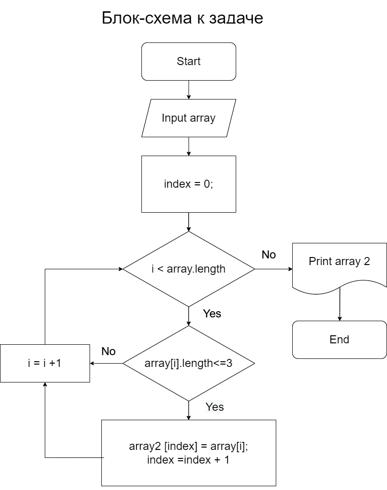

# *Итоговая проверочная работа*

Группа: GU_IT_Специалист_2278

Студент: Нестеров Евгений Михайлович

## Задание:

1. Создать репозиторий GitHub;
2. Нарисовать блок-схему алгоритма;
3. Снабдить репозиторий оформленным текстовым описанием решения (файл README.md);
4. Написать программу, решающую поставленную задачу;
5. Использовать контроль версий в работе над этим проектом (не должно быть залито одним коммитом. Как минимум этапы 2,3 и 4 должны быть расположены а разных коммитах);

Задача: написать программу, которая из имеющегося массива строк формирует массив из строк, длина которых меньше либо равна 3 символа. Первоначальный массив можно ввести с клавиатуры, либо задать на старте выполнения алгоритма. При решении не рекомендуется пользоваться коллекциями, лучше обойтись именно массивами.

## Блок-схема

Для решения задачи была построена блок-схема

## Описание решения:

1. Ввод элементов массива;
2. Задать счётчики элементов массива;
3. Создать цикл для сравнения счётчика с длиной массива;
4. Проверка условия: если счётчик меньше длины массива, то проверяем текущий элемент массива - меньше либо равно 3 символам;
5. Если текущий элемент массива меньше либо равен 3 символам, то необходимо положить его в массив номер 2, увеличить индекс массива 2 на единицу.
6. Увеличиваем счётчик в цикле на единицу;
7.	Выполняем цикл, пока счётчик не станет больше длины массива 1, тогда осуществляется выход из цикла и печать массива 2.

